# How to install the Redis Playground

The Redis playground is based on CloudFormation, the AWS Infastracture as software tool. The following guidelines are meant for people with zero experience in CloudFormation tool. 

If you are familiar with the concept of stacks and lambdas you can follow the [short version](#short-version). Otherwisse go Ahead for the [detailed one](#detailed-version).

Below you can find a schema of the architecture of what we are going to build:

<br></br>

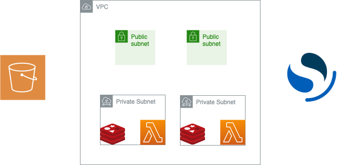

<br></br>
## Short version

- Create a stack using the cloud-formation/infrastacture/infrastructure.yaml and name it redis-demo-infra
- Before creating the lambdas:
  -  download the zips in the lambda-zips directory
     -  smarthome-producer.yaml
     -  smarthome-consumer.yaml
  -  download the dataset in the dataset directory
  -  load dataset and lambdas in s3
  -  update the cloud-formation/use-cases/smarthome.yaml in the mapping section at the top of the file to reflect your s3 bucket and key
- Create another stack using the updated cloud-formation/use-cases/smarthome.yaml
- Once you have the producer lambda update the link to your s3 bucket
- Run the lambdas

## Detailed Version

Table of Contents

- [How to install the Redis Playground](#how-to-install-the-redis-playground)
  - [Short version](#short-version)
  - [Detailed Version](#detailed-version)
    - [Prerequisites](#prerequisites)
    - [1. Deploy the infrastructure](#1-deploy-the-infrastructure)
      - [1.1 Reach the CloudFormation Page](#11-reach-the-cloudformation-page)
      - [1.2 Create a Cloud Formation Stack](#12-create-a-cloud-formation-stack)
        - [1.2.1 Load the template](#121-load-the-template)
        - [1.2.2 Choose a name](#122-choose-a-name)
        - [1.2.3 Add Tags if needed](#123-add-tags-if-needed)
        - [1.2.4 Give permission and create](#124-give-permission-and-create)
      - [1.3 Wait for the resources to be created](#13-wait-for-the-resources-to-be-created)
    - [1.4 Take a look to your resources](#14-take-a-look-to-your-resources)
    - [2. Deploy the producer and consumer](#2-deploy-the-producer-and-consumer)
      - [2.1 Download the lambdas zip and load them into s3](#21-download-the-lambdas-zip-and-load-them-into-s3)
      - [2.2 Set your s3 bucket and your key](#22-set-your-s3-bucket-and-your-key)
      - [2.3 Create the Lambdas' stack](#23-create-the-lambdas-stack)
    - [3. Let's recap](#3-lets-recap)
    - [4. Run the Lambdas](#4-run-the-lambdas)
      - [4.1 Go to the Lambda page](#41-go-to-the-lambda-page)
      - [4.2 Check the configuration timeout](#42-check-the-configuration-timeout)
      - [4.3 Create a fake test to run the lambda](#43-create-a-fake-test-to-run-the-lambda)
      - [4.4 Run the code](#44-run-the-code)
    - [5. Open Search](#5-open-search)
      - [5.1 Log in in Open Search](#51-log-in-in-open-search)
      - [5.2 Create an index](#52-create-an-index)
      - [5.3 Create a visualization](#53-create-a-visualization)
   1.2 

### [Prerequisites](#prerequisites)

- AWS account
- s3 bucket created (no need for public access)
  - if you need guidance on [how to create a bucket](https://docs.aws.amazon.com/AmazonS3/latest/userguide/create-bucket-overview.html)
- Clone this repo
```
git clone linktotherepo
```

### [1. Deploy the infrastructure](#1-deploy-the-infrastructure)

#### [1.1 Reach the CloudFormation Page](#11-reach-the-cloudformation-page)

[Login](https://console.aws.amazon.com/console/home?nc2=h_ct&src=header-signin) to the AWS Console. 
In the Top left corner click the search bar close 9 dots in a square shape. Type CloudFormation and click the first entry

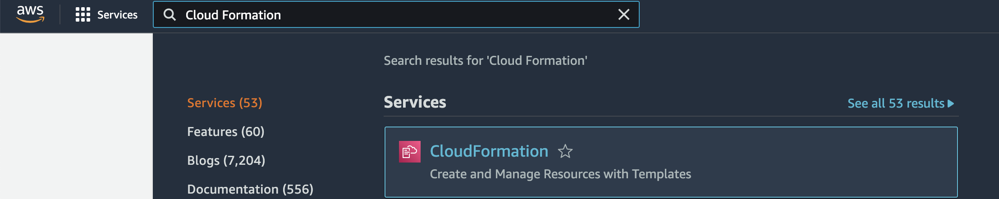

#### [1.2 Create a Cloud Formation Stack](#12-create-a-cloud-formation-stack)

In the main menu of CloudFormation click *Create Stack*.
In the next window click *With new Resources*

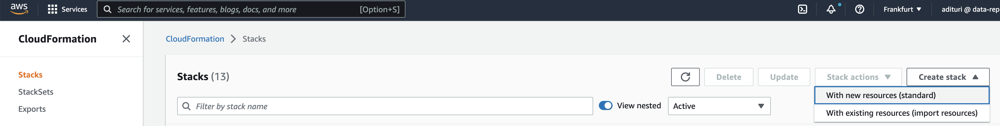

##### [1.2.1 Load the template](#121-load-the-template)

Leave the first section *Prerequisite - Prepare template* as it is with the option **Template is ready** selected.
In the *Specify Template* section select **Upload a template file**
Click *Choose file* and from this repo load the file called **infrastructure.yaml** in the *cloud-formation/infrastructure* folder.
Click Next

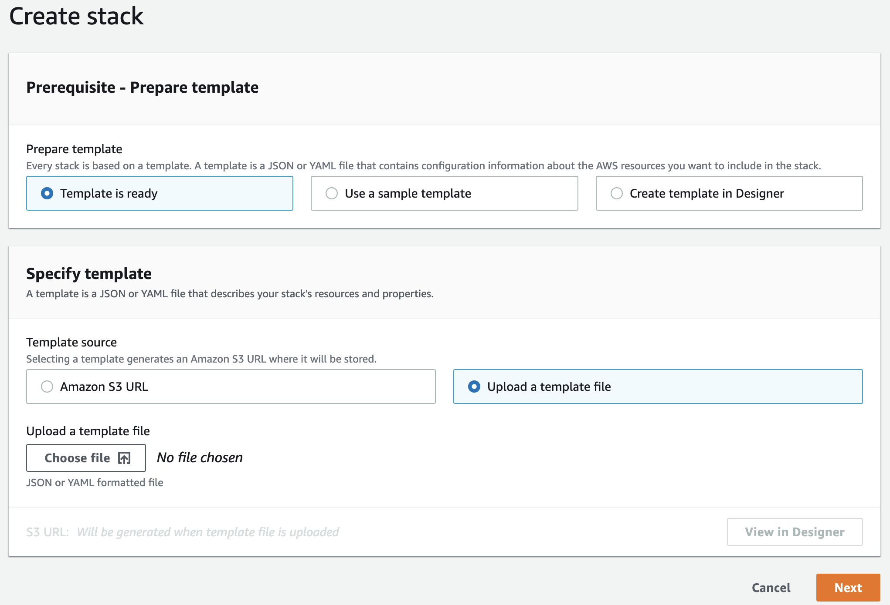

##### [1.2.2 Choose a name](#122-choose-a-name)
In the next window choose a name of your choice, no other information is needed.

##### [1.2.3 Add Tags if needed](#123-add-tags-if-needed)
Add tags if needed otherwise click next. 

##### [1.2.4 Give permission and create](#124-give-permission-and-create)

Scroll to bottom, acknowledge the terms of AWS.
Click create stack and wait for the resources to be created.

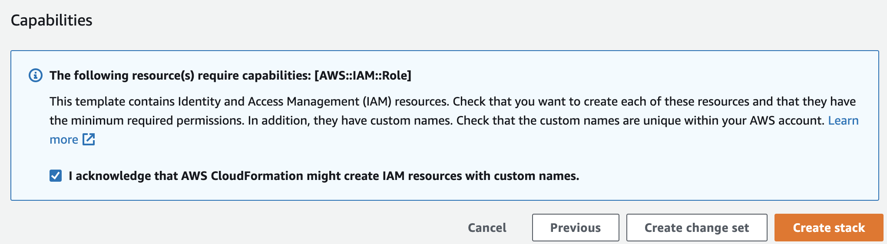

#### [1.3 Wait for the resources to be created](#13-wait-for-the-resources-to-be-created)

Please Note that the OpenSearch server need 15-20 min to be instanciated.

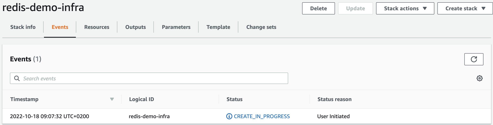

### [1.4 Take a look to your resources](#14-take-a-look-to-your-resources)

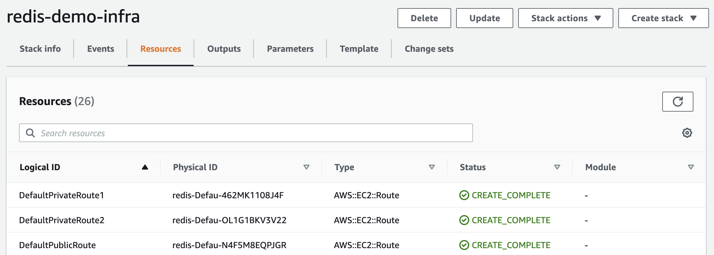

### [2. Deploy the producer and consumer](#2-deploy-the-producer-and-consumer)

In this section we are going to deploy the lambdas using CloudFormation, we will select the smarthome use case.
If at the moment you are reading this is the only usecase please don't panic, we will add more in the future.

#### [2.1 Download the lambdas zip and load them into s3](#21-download-the-lambdas-zip-and-load-them-into-s3)

Download the lambdas in the *lamda-zips* folder.
You will have two zips for each use case: one for the consumer and one for the producer. You can find them here:

- lambda-zips/smarthome-consumer.zip
- lambda-zips/smarthome-producer.zip 

Load both the zips in s3.
If you need guidance on how to load file into your s3 bucket follow [this guide](https://docs.aws.amazon.com/AmazonS3/latest/userguide/upload-objects.html).

#### [2.2 Set your s3 bucket and your key](#21-set-your-s3-bucket-and-your-key)

Change the mapping in the file *cloud-formation/use-cases/smarthome.yaml* to and set your s3 bucket name and path to the downloaded consumer and producer zip.

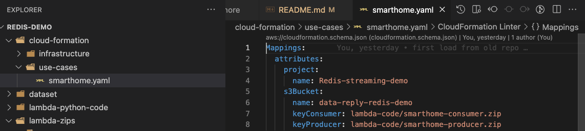

#### [2.3 Create the Lambdas' stack](#21-set-your-s3-bucket-and-your-key)

Repeat the steps from 1.1 to 1.4 to deploy a new CloudFormation stack which will create the producer and consumer Lambdas. 
This time you should load the *cloud-formation/use-cases/smarthome.yaml*

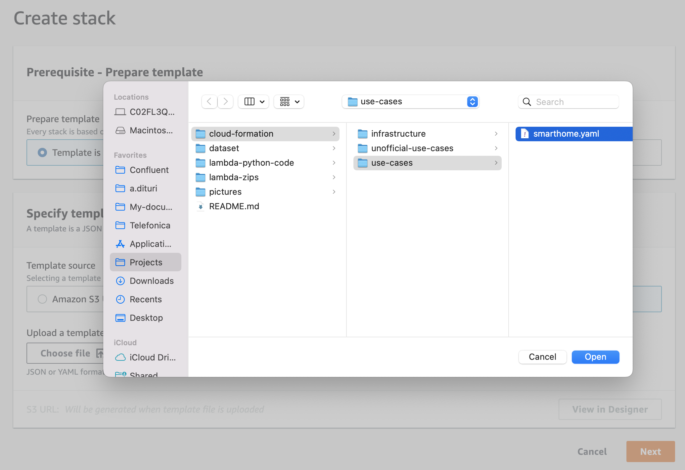


### [3. Let's recap](#3-lets-recap)

With this step all the resources needed to run the use cases are created:

- Network related resources (VPC, subnet, route tables, associations...)
- Permission related resources (security group, roles)
- ElastiCache cluster, OpensSearchServer
- Consumer and Producer Lambdas

If more help is needed check the [CloudFormation doc.](https://docs.aws.amazon.com/AWSCloudFormation/latest/UserGuide/cfn-console-create-stack.html)


### [4. Run the Lambdas](#4-run-the-lambdas)

#### [4.1 Go to the Lambda page](#41-go-to-the-lambda-page)
From the use cases stack select resources click the producer lambda, in this case SmartHomeProducer

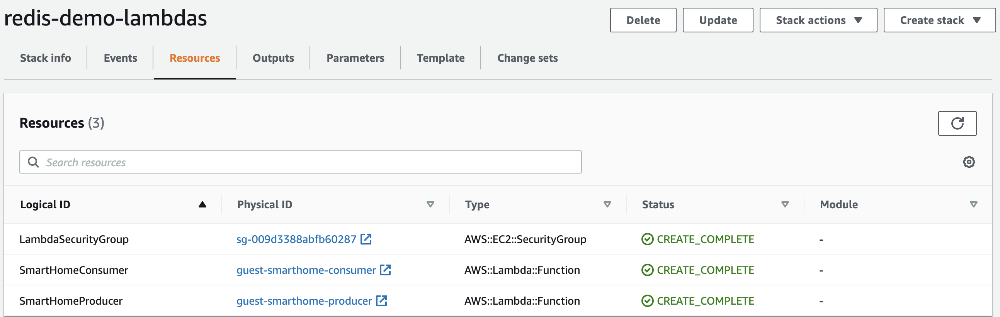

#### [4.2 Check the configuration timeout](#42-check-the-configuration-timeout)

Click and edit the general configuration.
Set 5min timeout (worst case scenario).

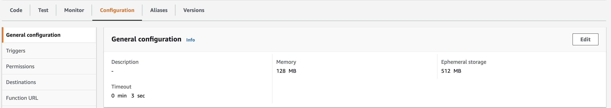

#### [4.3 Create a fake test to run the lambda](#43-create-a-fake-test-to-run-the-lambda)

Click test.
If it is the first time don't worry about the input, just give a random name like 'test' and leave anything else as it is. 
Clik Run. 

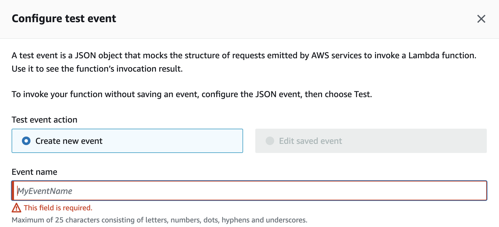

#### [4.4 Run the code](#44-run-the-code)
Now run the code and see that the first records are produced.
Do the same with the SmartHomeConsumer.

### [5. Open Search](#5-open-search)

This part is optional and can be skipped. 
It explains instruction to get a graph from the dataset.

#### [5.1 Log in in Open Search](#51-reach-the-open-search-page)

Go to the CloudFormation page in AWS.
From there select the infrastracture stack.
Select the resources and then click the OpenSearch link.

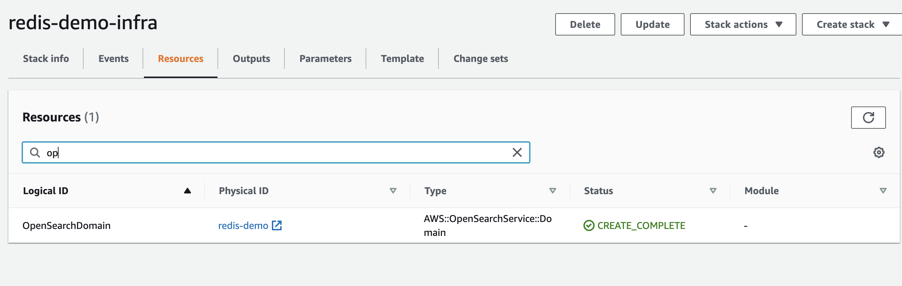

Click the Open Search Dashboard URl

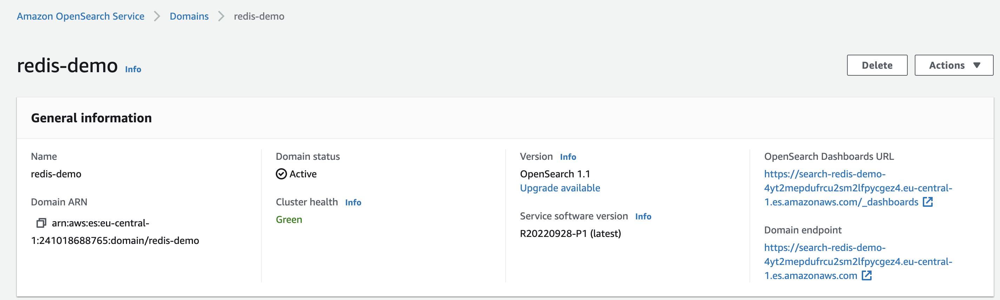

Log in with the credentials you find in the infrastructure.yaml
  - look for the OpenSearch section towards the bottom
  - look for the masterUserOptions property and right below you will find hardcoded username and password

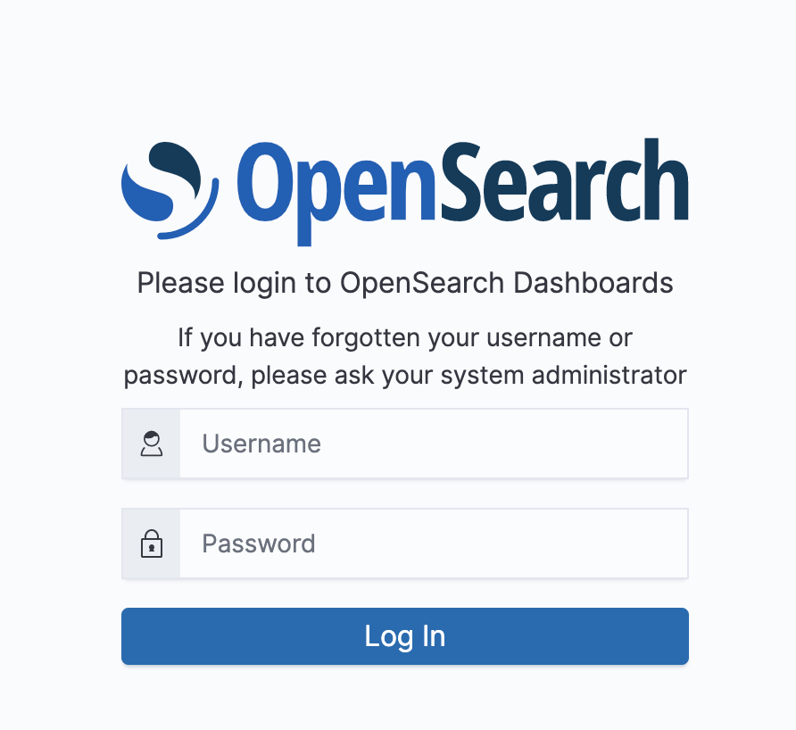

#### [5.2 Create an index](#52-create-an-index)

One you logged in open the menu on the left.
Click Stack Management in the Management block. 
Click index Patterns in the menu on the left.
Click Create index patter.

Provide any index-pattern that would match the index called 'first-index' created by the consumer.

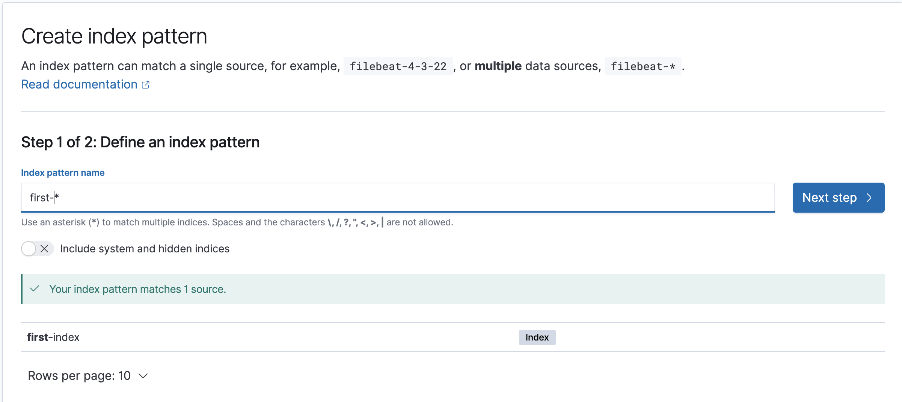

#### [5.3 Create a visualization](#53-create-a-visualization)
Once the data is loaded you can create a visualization of your choice, if you need guidance you can always take a look to the [doc](https://docs.aws.amazon.com/opensearch-service/latest/developerguide/walkthrough.html#walkthrough-analysis)
